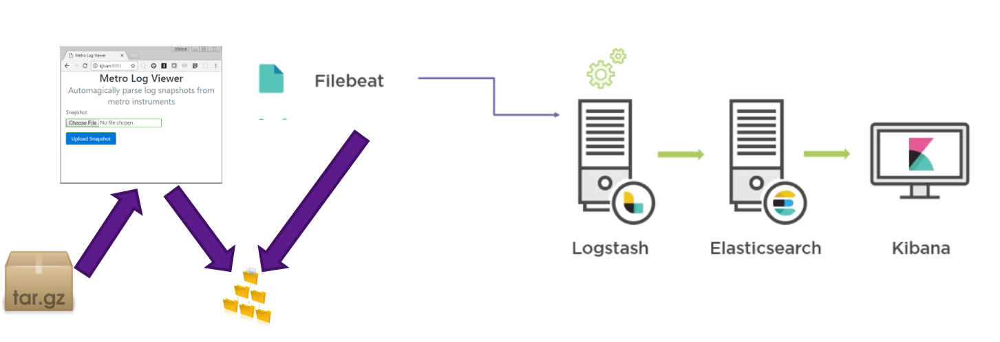
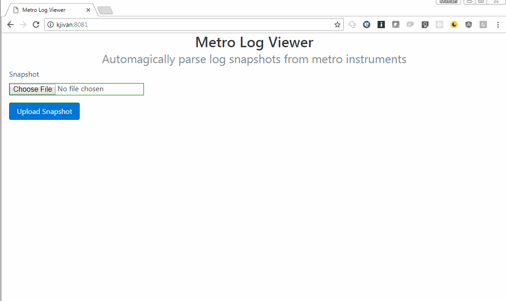

# Elastic Stack Hack

---

# Common Product Questions
- Which features are most/least used?
- Have we seen this issue in the field?
- What are the steps to reproduce a field issue?

---

## The Problem
Our instrument system and application logs have a great deal of information. We have thousands of data sources, but:

- We don't have historical data
- we can't easily analyze data we do get
- We often don't know the questions beforehand

---

### Elastic Stack Tech

---
## Elastic Stack Data Pipeline

---

### Demo

---

## Future Applications
### Track Customer Usage(App Launches/ui/clicks..)
#### Adoption of new features
### Tool for TAC
### Alert on Error(crash/etc..)
### Correlations(eg. versions vs crashes)

---

## MVP
1. Make it deployable to infrastructure
2. Teach TAC team to upload logs
3. Add alerts on app launches, crashes, warnings, etc...
4. Teach teams to develop their own queries

